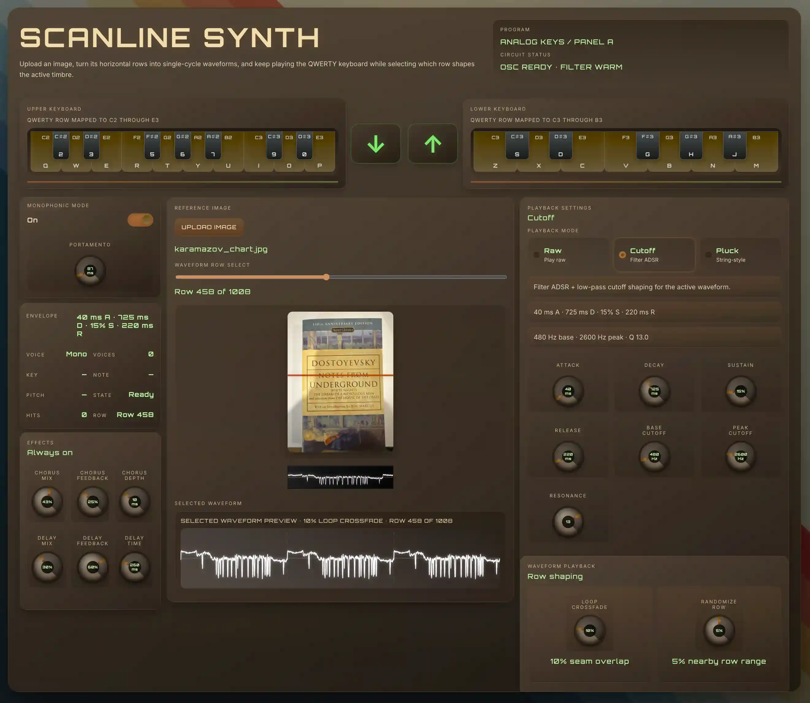

# Scanline Synth


Scanline Synth is a browser-based synthesizer that turns image data into playable sound.




It reads the horizontal rows of an image as single-cycle waveforms, lets you play those waveforms from your computer keyboard or the on-screen piano, and shapes the result with multiple playback modes and live controls.

## What it does

- Plays notes from a QWERTY keyboard layout
- Supports on-screen piano interaction with pointer dragging
- Loads a default synth image on startup
- Lets you upload your own image and convert each row into a waveform
- Switches between three playback modes:
  - **Raw**: direct waveform playback
  - **Cutoff**: waveform playback through a filter ADSR shape
  - **Pluck**: Karplus-Strong style string/pluck synthesis
- Supports **monophonic** and **polyphonic** behavior
- Includes **portamento**, **filter controls**, **chorus**, **delay**, **waveform crossfade**, and **row randomness**
- Shows visual previews for the uploaded image and selected waveform row

## Core idea

Each horizontal scanline of an image becomes one waveform.

That means visual texture turns into timbre:

- brighter/darker patterns affect the waveform shape
- different rows create different tones
- switching rows changes the sound color
- crossfading and row randomization make the instrument feel more alive

## Tech stack

- **TypeScript**
- **Lit** for UI rendering
- **Vite** for local development and bundling
- **Web Audio API** for synthesis
- **LLLTS** authoring/test tooling
- **pnpm** as the package manager

## Getting started

### Requirements

- Node.js
- pnpm

### Install

From the `client` folder:

```bash
pnpm install
```

If needed, the project also exposes a shortcut:

```bash
pnpm run i
```

## Running locally

From `client/`:

```bash
pnpm dev
```

This uses the project’s TypeScript emit watcher plus Vite workflow.

You can also run the parts separately:

```bash
pnpm dev:vite
pnpm dev:emit
```

Then open the local Vite URL in your browser.

## Available scripts

Inside `client/package.json`:

- `pnpm dev` — run the local development workflow
- `pnpm dev:vite` — run Vite only
- `pnpm dev:emit` — run TypeScript emit watch mode
- `pnpm typecheck` — TypeScript no-emit watch
- `pnpm build` — production build
- `pnpm preview` — preview the production build
- `pnpm lll-server` — start the LLLTS server
- `pnpm lll-check` — run the LLLTS project check entrypoint

## How to use the app

1. Start the dev server.
2. Open the app in a browser.
3. Use the **QWERTY keyboard** to play notes.
4. Toggle **monophonic/polyphonic** behavior.
5. Adjust **portamento** and playback settings.
6. Switch between **Raw**, **Cutoff**, and **Pluck** modes.
7. Upload an image to hear its rows as waveforms.
8. Change the selected row and compare the resulting timbres.
9. Fine-tune the sound with effects and waveform controls.

## Controls and features

### Keyboard input

The synth maps a section of the computer keyboard to chromatic notes, similar to many software synths.

It also includes visible keyboard guides so the musical layout is easy to follow.

### Playback modes

#### Raw

Plays the current waveform directly with minimal shaping.

#### Cutoff

Routes the waveform through a low-pass filter with ADSR-style cutoff control. This is the default mode and gives the instrument its more animated synth behavior.

#### Pluck

Uses a Karplus-Strong inspired pluck/string model for a more percussive, string-like response.

### Image waveform synthesis

When an image is loaded:

- each horizontal row is sampled from canvas pixel data
- luminance is converted into waveform values
- the row is normalized into a usable audio range
- the selected row becomes the synth waveform source

### Live sound shaping

The app includes controls for:

- monophonic mode
- portamento
- filter attack, decay, sustain, release, cutoff, resonance
- chorus mix, feedback, and depth
- delay mix, feedback, and time
- pluck damping, brightness, and noise blend
- waveform seam crossfade
- waveform row randomness

## Testing and validation

The project includes LLLTS tests in `client/src/*.test.lll.ts`, including behavioral coverage around:

- default monophonic behavior
- portamento defaults and updates
- playback mode switching
- cutoff settings visibility and summaries
- keyboard play while changing modes

To run the main project validation:

```bash
cd client
pnpm lll-check
```

To build the app:

```bash
cd client
pnpm build
```

## Notes

- The app depends on browser audio support through the Web Audio API.
- Some browser autoplay restrictions may require a user interaction before audio starts.
- A default image is loaded so the synth is immediately playable without upload.

## Why the name “Scanline Synth”?

Because the instrument treats image scanlines as sound-generating waveforms. Visual rows become audio cycles.

## License

No license file is currently included in this repository.
